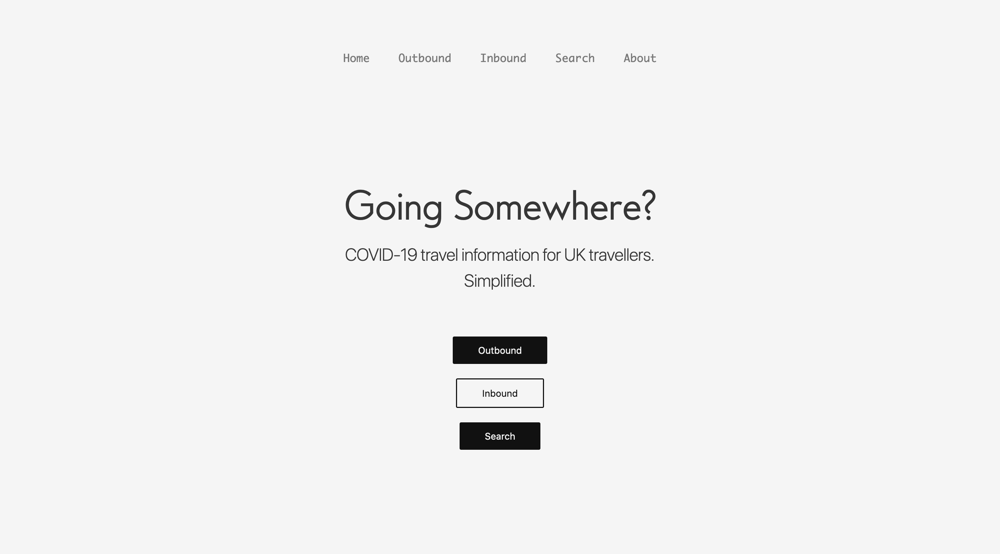
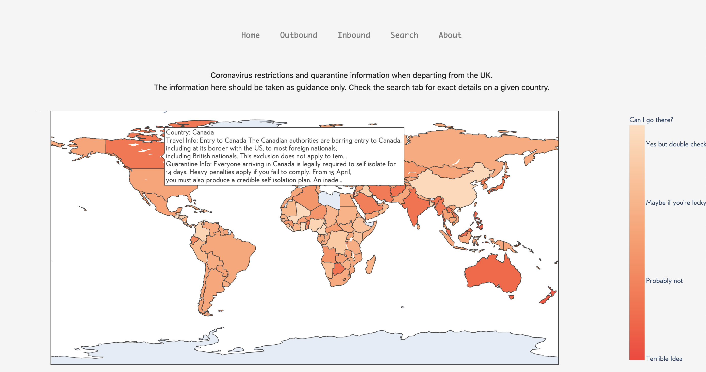
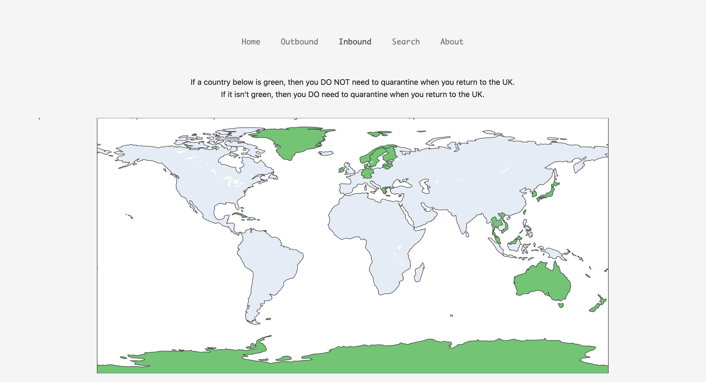
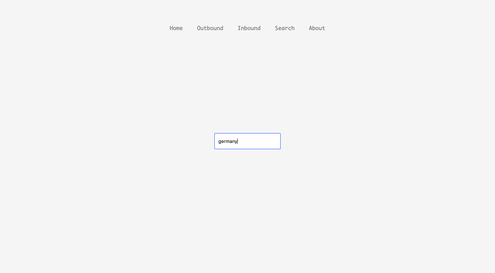
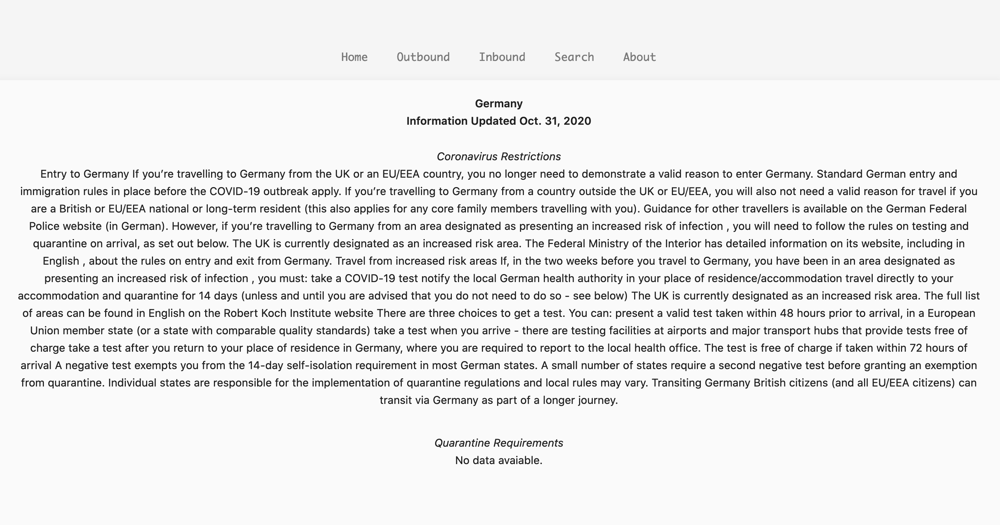

# COVID-19 UK Travel Site
>  A Web App that Uses Machine Learning to Simplify COVID-19 Travel Info
>

## Table of contents
* [General info](#general-info)
* [Technologies](#technologies)
* [Features](#features)
* [Data Sources](#sources)
* [Inspiration](#inspiration)
* [Contact](#contact)

## General info
This app has been made in response to cancelled holidays, refund rejections, and a desire to get a speedy overview of 
the national travel situation before making plans.

## Technologies
* Python 3.8
* Keras
* Tensorflow
* Django 
* Plotly 
* Pandas
* Requests
* Bs4
* Pytest

## Features
* Multi-tab Django web app
* Custom command to update a sqlite database by making API calls to the gov.uk publishing service
* Plotly scattermapbox plots
* Basic search functionality

## Sources
[UK Government API](https://content-api.publishing.service.gov.uk/#gov-uk-content-api)

## Inspiration
This project was born purely from frustration.

## Contact
Created by Alex Darby - feel free to contact me on os1ntal3x@gmail.com !
